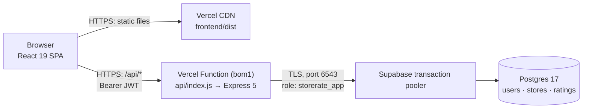
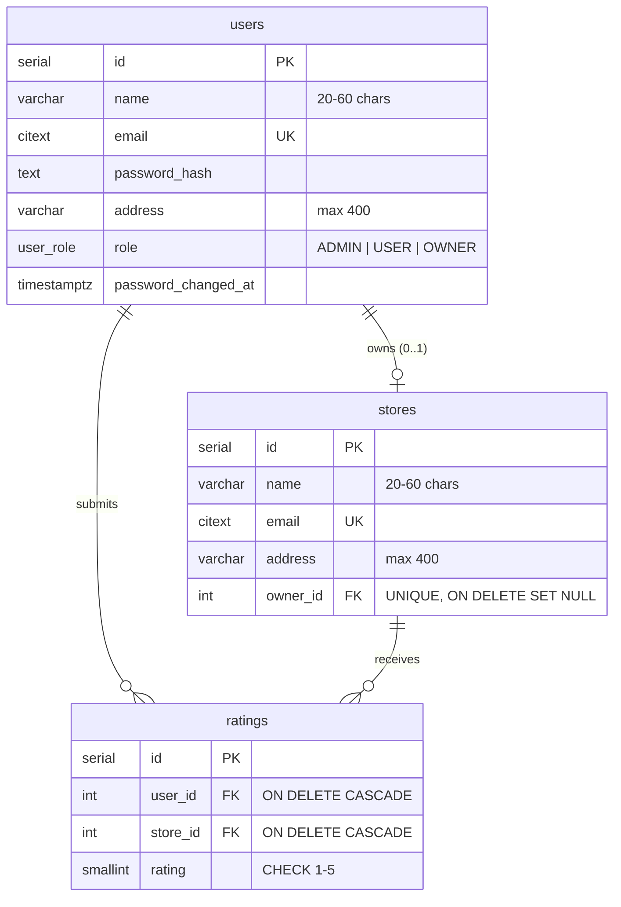

# StoreRate — Project Overview

A full-stack store rating platform built for the Roxiler FullStack Intern Coding Challenge.
Users rate registered stores from 1 to 5. One login serves three roles (System Administrator,
Normal User, Store Owner), and each role gets its own set of screens and API permissions.

> Real secrets (database password, JWT secret) are **not** in this file. They are in
> `SECRETS.local.md`, which is gitignored and only exists in the working copy where it was created.

---

## 1. Links

| What | URL |
|------|-----|
| Live app (production) | https://roxiler-storerate-rho.vercel.app |
| Health check (API + DB) | https://roxiler-storerate-rho.vercel.app/api/health |
| GitHub repository | https://github.com/Georgian-86/Roxiler |
| Production branch | https://github.com/Georgian-86/Roxiler/tree/main |
| CI runs (GitHub Actions) | https://github.com/Georgian-86/Roxiler/actions |
| Vercel project dashboard | https://vercel.com/golus-projects/roxiler-storerate |
| Supabase project dashboard | https://supabase.com/dashboard/project/rkjahfmbsmylelbmhlru |

Other production aliases: `roxiler-storerate-golus-projects.vercel.app`,
`roxiler-storerate-git-main-golus-projects.vercel.app`.

---

## 2. Demo credentials

All demo accounts use the password **`Password@123`**.

| Role | Email | Lands on |
|------|-------|----------|
| System Administrator | `admin@roxiler.com` | `/admin` — dashboard, users, stores |
| Normal User | `user@roxiler.com` | `/stores` — browse, search, rate |
| Normal User | `rahul@roxiler.com` | `/stores` |
| Store Owner | `owner@roxiler.com` | `/owner` — Sunrise Organic Grocery Market |
| Store Owner | `owner2@roxiler.com` | `/owner` — Metro Electronics Superstore |

You can also create a new Normal User from the **Sign up** page.

---

## 3. IDs and infrastructure

### Vercel

| Item | Value |
|------|-------|
| Team | Golus's projects (`golus-projects`) |
| Team ID | `team_Om9MRcEqM9bCQuQ3NoHwhurG` |
| Project name | `roxiler-storerate` |
| Project ID | `prj_1lCRsHEw74tObGiAsjU1uwQLBOsk` |
| Function region | `bom1` (Mumbai) |
| Git integration | `Georgian-86/Roxiler`, production branch `main` (each push deploys) |

### Supabase

| Item | Value |
|------|-------|
| Organization | Georgian-86's Org (`flkoimkmgkbizjubynca`) |
| Project name | `roxiler-storerate` |
| Project ref / ID | `rkjahfmbsmylelbmhlru` |
| Region | `ap-south-1` (Mumbai) |
| Postgres engine | 17 |
| Connection used by the app | Transaction pooler — `aws-0-ap-south-1.pooler.supabase.com:6543` |
| App database role | `storerate_app` (pooler username `storerate_app.rkjahfmbsmylelbmhlru`) |

Note: the Supabase project `lld-practise` was **paused** to stay within the free plan's two-project
limit. You can restore it from the Supabase dashboard whenever you need it.

### GitHub

| Item | Value |
|------|-------|
| Repository | `Georgian-86/Roxiler` |
| Default / production branch | `main` |
| Development branch | `claude/epic-cori-o1qa2j` |
| CI | `.github/workflows/ci.yml` — backend lint and tests against Postgres; frontend lint, tests and build |

### Vercel environment variables (names only)

| Key | Purpose |
|-----|---------|
| `DATABASE_URL` | Supabase pooler URL for the `storerate_app` role (sensitive) |
| `JWT_SECRET` | Key used to sign login tokens (sensitive) |
| `DATABASE_SSL` | `true` — TLS to Supabase |
| `DB_POOL_MAX` | `3` — small connection pool per serverless instance |
| `TRUST_PROXY` | `1` — real client IPs for rate limiting behind Vercel |

---

## 4. Architecture



One Vercel project serves both halves of the app:

- **Frontend:** Vite builds the React app to static files, which are served from Vercel's CDN.
  `vercel.json` rewrites every non-asset path to `index.html`, so client-side routes such as
  `/admin/users` load directly.
- **Backend:** the whole Express app runs as one serverless function (`api/index.js`), and every
  `/api/*` request goes to it. The function runs in Mumbai, next to the database.
- **Database:** Supabase Postgres, reached through the transaction pooler. Serverless instances come
  and go quickly, and the pooler stops them from exhausting Postgres connections.

### Request flow (example: a user rates a store)

1. The browser sends `PUT /api/stores/12/rating` with `{ "rating": 4 }` and the JWT.
2. `middleware/auth.js` verifies the token, reloads the user from the database, and rejects it if
   the password changed after the token was issued.
3. `authorize('USER')` lets only Normal Users through.
4. `validate([...])` checks that the rating is an integer from 1 to 5.
5. `storeService.upsertRating` runs `INSERT … ON CONFLICT (user_id, store_id) DO UPDATE`, so the
   first rating creates a row (201) and later ones update it (200). It returns the new average.
6. The React row updates in place, or the list refetches if it is sorted by rating.

### Backend layers (`backend/src`)

| Layer | Folder | Responsibility |
|-------|--------|----------------|
| Routes | `routes/` | HTTP shape: `auth`, `admin`, `stores` (normal user), `owner` |
| Middleware | `middleware/` | JWT auth and role guard, validation, error handling |
| Validators | `validators/` | Shared field rules (name, email, address, password, role) |
| Services | `services/` | SQL queries and business rules |
| Utils | `utils/` | `ApiError`, whitelisted sort, parameterised filters, pagination |
| DB | `db/` | Pool, migration runner, SQL migrations, seed script |

### Frontend structure (`frontend/src`)

| Folder | Contents |
|--------|----------|
| `api/` | Axios client: adds the token and logs out on 401 |
| `context/` | Auth provider (current user, login, logout) and toast notifications |
| `hooks/` | `useForm` (client validation that mirrors the API) and `useList` (server-side filter, sort and pages, debounced) |
| `components/` | `DataTable` (sortable headers), `FilterBar`, `Pagination`, `Modal`, `StarRating`, `Layout`, `ProtectedRoute` |
| `pages/` | Login, Register, Change Password, `admin/*`, `user/*`, `owner/*` |

### Data model



- `UNIQUE (user_id, store_id)` allows one rating per user per store.
- Average ratings are calculated with `AVG()` when read, so they can never drift out of sync.
- `CHECK` constraints repeat the form rules, so bad data can't get in even if the API is bypassed.
- `updated_at` columns are maintained by triggers. `ratings(store_id)` is indexed for the averages.

### Security

- Passwords are hashed with bcrypt. Login takes the same time and gives the same error whether or
  not the email exists.
- Tokens expire after 1 day. Changing your password revokes older tokens, and the current session
  gets a fresh one.
- Sort columns come from a fixed whitelist and filters are parameterised, so there is no SQL
  injection. `%` and `_` in search text are treated literally.
- Helmet security headers, a JSON body size limit, and rate limiting on login and sign-up.
- In Supabase, the app uses its own `storerate_app` role, which can only read and write the app
  tables (through RLS policies). The tables have RLS enabled and no grants for `anon` or
  `authenticated`, so Supabase's public Data API can't reach them. Supabase's security advisor
  reports no issues.

---

## 5. Features by role

| Role | Features |
|------|----------|
| System Administrator | Dashboard totals (users, stores, ratings) · add Normal, Admin and Owner users · add stores and assign or change their owner · user list and store list with filters (name, email, address, role), sortable columns and pages · user detail page showing the store's rating for owners · change password · log out |
| Normal User | Sign up and log in · browse all stores · search by name or address · see the overall rating and your own rating · submit or change a 1–5 rating · sort any column · change password · log out |
| Store Owner | Dashboard with the store's average rating, a 1–5 star breakdown, and a sortable, paged list of customers who rated it · change password · log out |

Form rules, enforced in the browser, the API and the database: **Name** 20–60 characters ·
**Address** required, at most 400 characters · **Password** 8–16 characters with at least one
uppercase letter and one special character · **Email** standard format, unique regardless of case.

---

## 6. Testing

| Suite | Command | Result |
|-------|---------|--------|
| Backend integration tests (Jest + Supertest, real Postgres) | `cd backend && npm test` | 53 passing |
| Frontend unit tests (Vitest) | `cd frontend && npm test` | 5 passing |
| Lint | `npm run lint` in each package | clean |
| Live API smoke test | `BASE_URL=https://roxiler-storerate-rho.vercel.app node scripts/smoke-test.mjs` | 34/34 passing on production |
| Live browser smoke test (Playwright) | `BASE_URL=https://roxiler-storerate-rho.vercel.app node scripts/ui-smoke-test.mjs` | 15/15 passing on production |

The smoke tests create records with `smoke-*@example.com` and `ui-*@example.com` emails, which can
be deleted afterwards.

---

## 7. Running locally

```bash
docker compose up -d db                       # Postgres on :5432 (creates roxiler + roxiler_test)
cd backend && cp .env.example .env && npm install
npm run seed && npm run dev                   # API on http://localhost:4000
cd ../frontend && npm install && npm run dev  # App on http://localhost:5173 (proxies /api)
```

## 8. Deploying changes

Push to `main` and Vercel builds and deploys automatically. Schema changes go in a new file under
`backend/src/db/migrations/`. Apply it to Supabase before deploying code that depends on it.
